# honeytoken-aws-detection-demo

# 🛡️ Simulation de fuite de clé AWS avec GitGuardian Honeytoken

Ce projet démontre comment simuler une fuite d'un secret AWS à l'aide d'un honeytoken GitGuardian placé dans un dépôt GitHub public.

## 🎯 Objectif

- Comprendre comment les bots réagissent aux fuites de secrets
- Tester GitGuardian en condition réelle
- Former les équipes à la gestion de secrets

## 🧪 Étapes principales

1. Création d'un honeytoken sur GitGuardian
2. Insertion du token dans un fichier `.env` crédible
3. Publication dans un dépôt public GitHub
4. Observation des alertes générées (100+ en moins de 30 minutes)

## 📸 Captures

📂 Voir le dossier `/screenshots` ou le fichier `documentation-fr.pdf`.

## 🧠 Auteur

Antonio Ferreira – Intégrateur d'applications | Spécialiste en authentification Azure AD | SSO · OAuth2 · OpenID Connect · SAML · MFA · Microsoft Entra ID · PowerShell

🔗 [linkedin.com/in/antonio-ferreira](https://www.linkedin.com/in/antoniofos/)

---

⚠️ Ce projet est uniquement à des fins de démonstration éducative.

📘 Documentation complète

## 📸 Captures d'écran (Étapes clés)

Voici les principales étapes illustrées avec des captures réelles du test.

### Étape 1 – Créer un compte GitGuardian
1.	Rendez-vous sur https://dashboard.gitguardian.com
2.	Créez un compte gratuit ou connectez-vous avec votre compte GitHub.
 
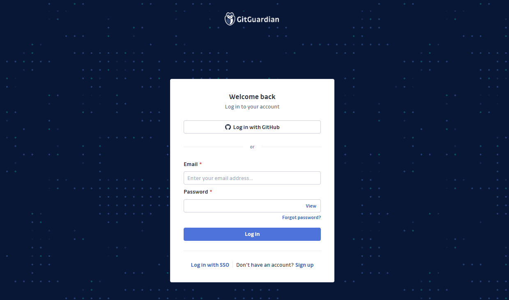

3.	Une fois connecté, GitGuardian commencera automatiquement à surveiller vos dépôts publics si l'intégration GitHub est activée.
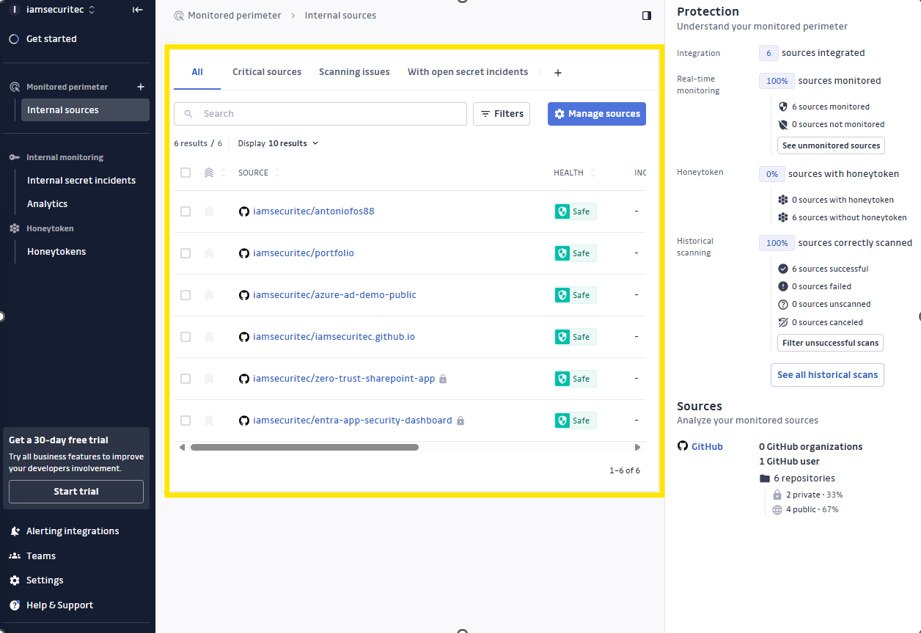

### Étape 3 - Créer un honeytoken
1.	Cliquez sur Honeytokens dans le menu latéral.
2.	Cliquez sur "Create Honeytoken".

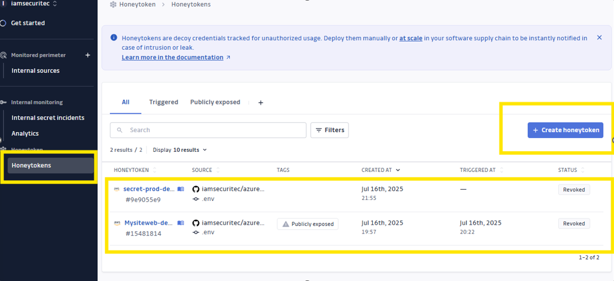

3.	Donnez un nom et une description à votre token (ex. : aws-dev-key-test).
4.	Cliquez sur “Create”.

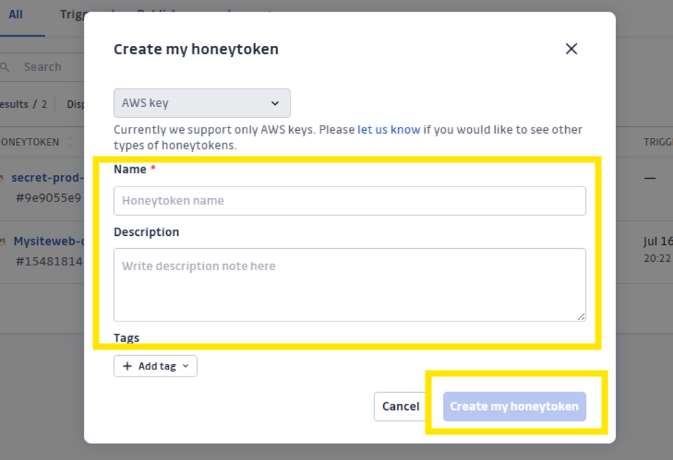

### Étape 5 – Confirmation du commit
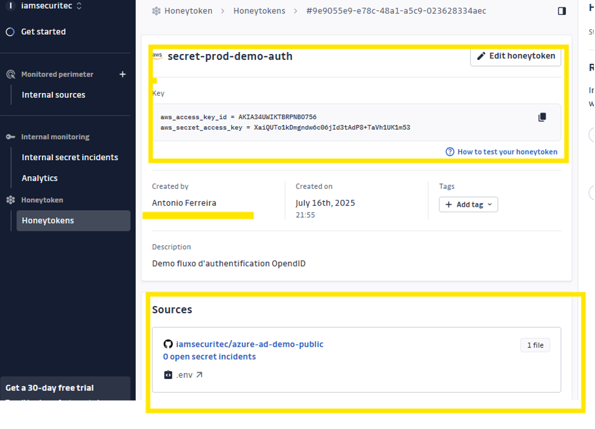

### Étape 6 – Détection par GitGuardian
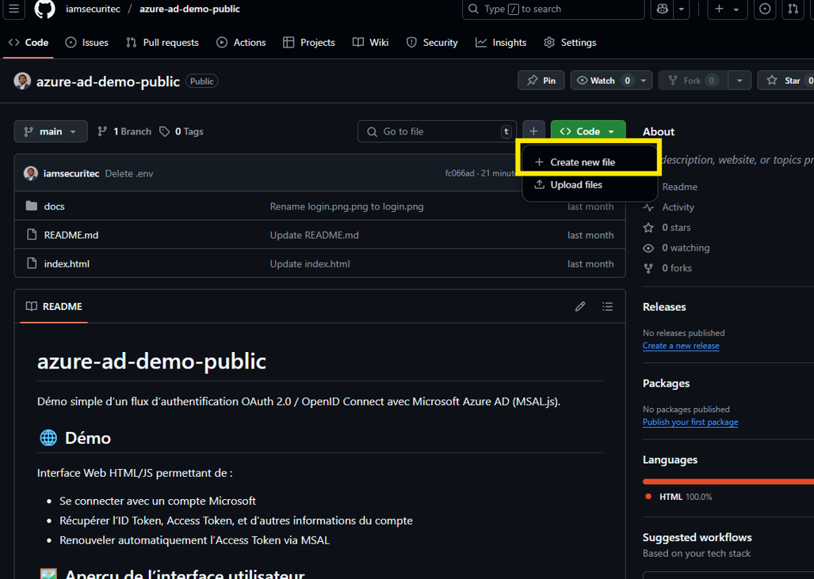

### Étape 7 – Alertes reçues (exemple)
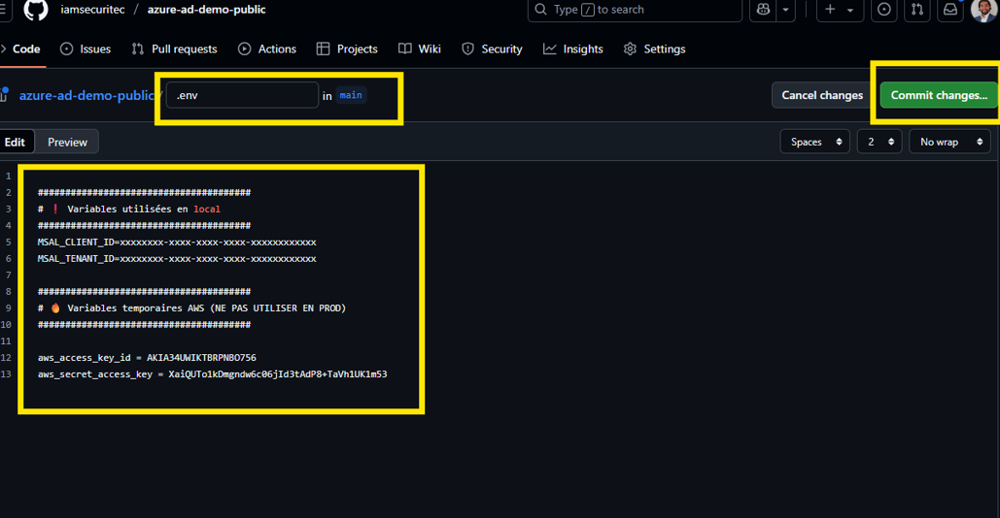

### Étape 8 – Analyse des IPs et User-Agent
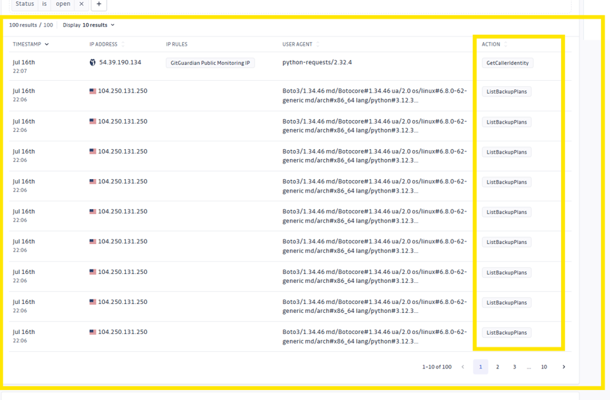

### Étape 9 – Vue d'ensemble des événements
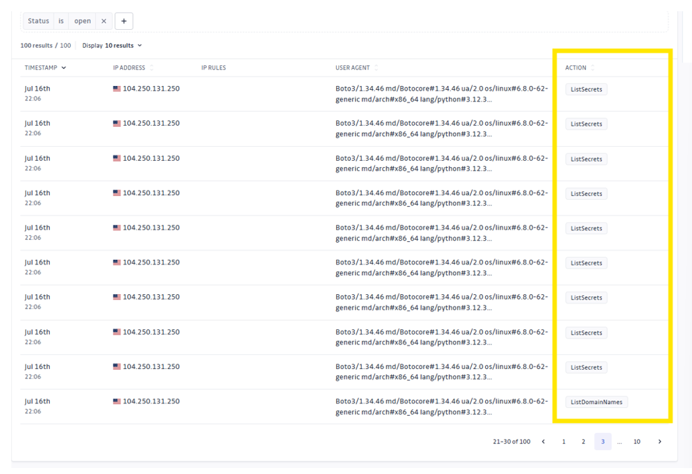

### Étape 10 – Tentatives de privilèges
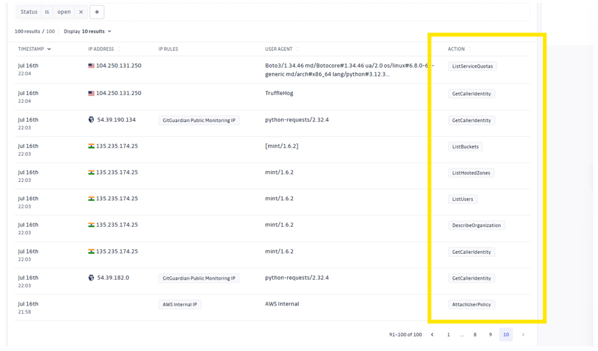

### Étape 11 – Révocation du token
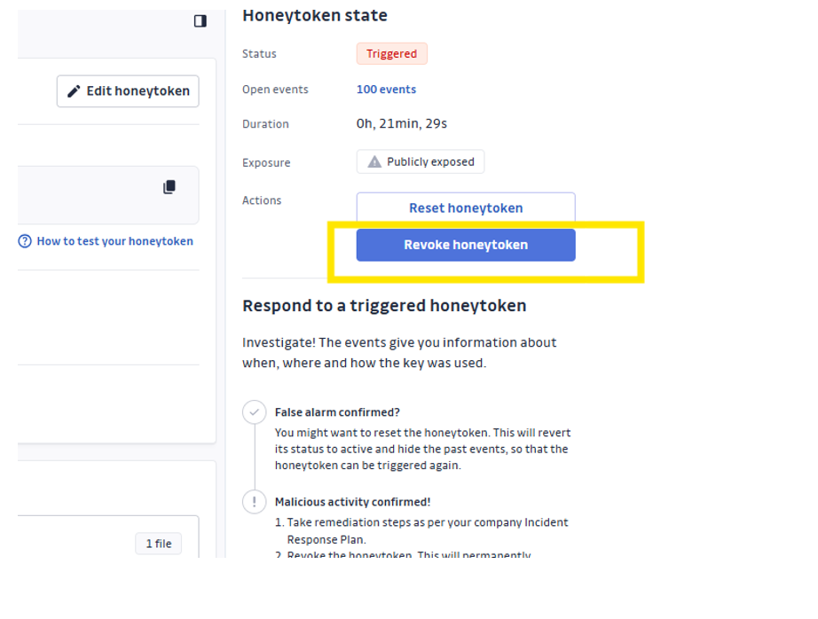

### Étape 12 – Clôture et bilan du test
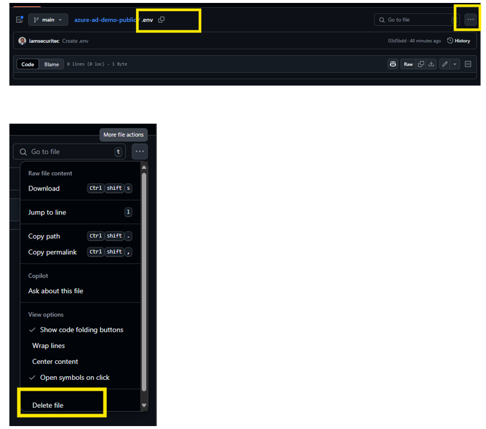
